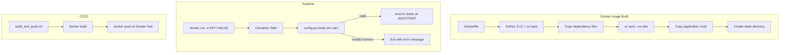

# Design Document: Dockerfile Setup

## Overview

This design adds Docker containerization to the kasbench-load-generator service. It encompasses four deliverables:

1. A multi-stage Dockerfile using `ghcr.io/astral-sh/uv` with Python 3.12 that produces a minimal production image
2. An updated `config.py` that reads all settings from environment variables with type validation
3. A `build_and_push.sh` shell script for Docker Hub publishing
4. README documentation with Docker usage examples

The key design decision is refactoring `config.py` from hardcoded constants to a validated environment-variable-based configuration loader. This allows operators to customize all 8 settings at container runtime without rebuilding the image while maintaining fail-fast behavior for invalid numeric values.

## Architecture



The container architecture is straightforward: a single-process container running the FastAPI app via uvicorn. The `/data` volume mount point provides persistence for the SQLite database and output logs across container restarts.

## Components and Interfaces

### 1. Dockerfile

Location: `Dockerfile` (project root)

Base image: `ghcr.io/astral-sh/uv:python3.12-bookworm-slim`

This image provides both Python 3.12 and uv pre-installed, eliminating the need for a separate uv installation step.

**Build stages:**
- Single stage (no multi-stage needed since uv is in the base image)
- Install production dependencies via `uv sync --no-dev`
- Copy application source
- Create `/data` directory
- Declare ENV defaults, EXPOSE, and CMD

**Rationale for base image choice:** The official `ghcr.io/astral-sh/uv` images are the recommended approach for uv-based projects in Docker. The `python3.12-bookworm-slim` variant provides a small image size while including necessary system libraries.

### 2. config.py (Refactored)

Location: `src/kasbench_load_generator/config.py`

The current implementation uses hardcoded values with `os.path.expanduser`. The refactored version will:

1. Read each setting from `os.environ.get(KEY, default)`
2. For numeric settings, parse with `int()` and validate positive
3. On invalid numeric input, raise `SystemExit` with descriptive error to stderr
4. Expose the same module-level constants (DB_PATH, OUTPUT_PATH, HOST, PORT, etc.) for backward compatibility

**Interface (unchanged):**
```python
# String settings
DB_PATH: str
OUTPUT_PATH: str
HOST: str
RABBITMQ_HOST: str

# Integer settings (validated as positive int)
PORT: int
TERMINATION_TIMEOUT_SECONDS: int
STATUS_UPDATE_TIMEOUT_SECONDS: int
RABBITMQ_PORT: int
```

**Validation helper:**
```python
def _parse_positive_int(name: str, default: int) -> int:
    """Parse env var as positive integer, exit with error if invalid."""
```

This helper is the testable core of the configuration system.

### 3. build_and_push.sh

Location: `build_and_push.sh` (project root)

A POSIX-compatible shell script that:
1. Validates exactly 2 CLI arguments (repo name, version tag)
2. Runs `docker build -t <repo>:<tag> .`
3. Runs `docker push <repo>:<tag>`
4. Uses `set -e` for fail-fast on any command error
5. Prints specific error messages to stderr on failure

### 4. README Update

Adds a "Docker" section with:
- Build command
- Run command (with port mapping)
- Run with env overrides example
- Environment variable reference table

## Data Models

No new data models are introduced. The existing config module interface is preserved — all consumers (`app.py`, `subprocess_manager.py`, `main.py`) continue importing from `config` without changes.

**Environment Variable Mapping:**

| Variable | Type | Default | Used By |
|----------|------|---------|---------|
| `DB_PATH` | str | `/data/kasbench.db` | app.py, subprocess_manager.py |
| `OUTPUT_PATH` | str | `/data/output.log` | app.py, subprocess_manager.py |
| `HOST` | str | `0.0.0.0` | main.py |
| `PORT` | int | `8080` | main.py |
| `TERMINATION_TIMEOUT_SECONDS` | int | `10` | subprocess_manager.py |
| `STATUS_UPDATE_TIMEOUT_SECONDS` | int | `5` | subprocess_manager.py |
| `RABBITMQ_HOST` | str | `localhost` | locust_common/rabbitmq.py |
| `RABBITMQ_PORT` | int | `5672` | locust_common/rabbitmq.py |

## Correctness Properties

*A property is a characteristic or behavior that should hold true across all valid executions of a system — essentially, a formal statement about what the system should do. Properties serve as the bridge between human-readable specifications and machine-verifiable correctness guarantees.*

### Property 1: String environment variable override

*For any* string configuration variable (DB_PATH, OUTPUT_PATH, HOST, RABBITMQ_HOST) and *for any* non-empty string value, when the corresponding environment variable is set to that value, the config module SHALL return that exact value; when the environment variable is unset, the config module SHALL return the documented default.

**Validates: Requirements 2.1, 2.2, 2.3, 2.7, 2.9**

### Property 2: Integer environment variable parsing

*For any* numeric configuration variable (PORT, TERMINATION_TIMEOUT_SECONDS, STATUS_UPDATE_TIMEOUT_SECONDS, RABBITMQ_PORT) and *for any* positive integer value, when the corresponding environment variable is set to the string representation of that integer, the config module SHALL return that integer; when the environment variable is unset, the config module SHALL return the documented default integer.

**Validates: Requirements 2.4, 2.5, 2.6, 2.8, 2.9**

### Property 3: Invalid numeric environment variable rejection

*For any* numeric configuration variable and *for any* string that cannot be parsed as a positive integer (including non-numeric strings, negative integers, zero, floating-point numbers, and empty strings), the config module SHALL raise a SystemExit with an error message that identifies the invalid variable name.

**Validates: Requirements 2.10**

## Error Handling

### Configuration Validation Errors

When `config.py` is imported and a numeric environment variable contains an invalid value:
- The module calls `sys.exit(1)` after printing to stderr: `"Error: {VAR_NAME} must be a positive integer, got '{value}'"`
- This causes the container to fail immediately on startup, making misconfiguration visible in `docker logs`

### Build Script Errors

| Condition | Exit Code | Stderr Message |
|-----------|-----------|----------------|
| Missing arguments | 1 | `Usage: build_and_push.sh <repository> <version_tag>` |
| Docker build failure | Non-zero (from docker) | `Error: Docker build failed` |
| Docker push failure | Non-zero (from docker) | `Error: Docker push failed` |

### Container Runtime

The container inherits existing error handling from the FastAPI application (409/422/500/503 responses). No additional error handling is needed at the Docker layer.

## Testing Strategy

### Property-Based Tests (Hypothesis)

The `config.py` validation logic is suitable for property-based testing because:
- The `_parse_positive_int` helper is a pure function with clear input/output
- The input space (arbitrary strings) is large
- Universal properties hold across all valid/invalid inputs

**Library:** Hypothesis (already in dev dependencies)

**Configuration:** Minimum 100 iterations per property test.

Each property test must be tagged with:
- **Feature: dockerfile-setup, Property {N}: {property_text}**

Tests will be placed in `tests/test_config.py`.

### Unit Tests (Example-Based)

- Verify each default value when env vars are unset
- Verify the Dockerfile contains required instructions (SMOKE-level checks as assertions)
- Verify `build_and_push.sh` argument validation (via subprocess invocation)

### Integration Tests

- Build the Docker image and verify it starts successfully with default config
- Build the Docker image and verify env var overrides work via `docker run -e`
- These are manual/CI tests, not part of the automated test suite

### What Is NOT Tested with PBT

- Dockerfile structure (static configuration → smoke tests)
- Shell script behavior (side-effect operations → example-based tests)
- README content (documentation → manual review)
- Docker Hub push (external service → CI integration test)
