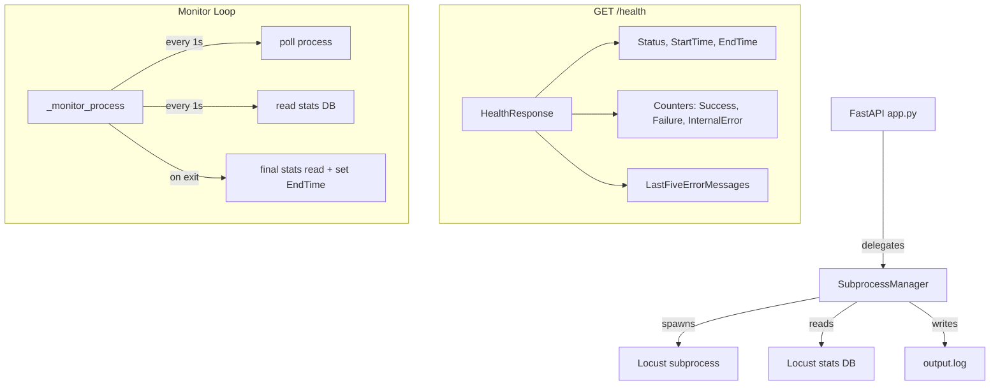
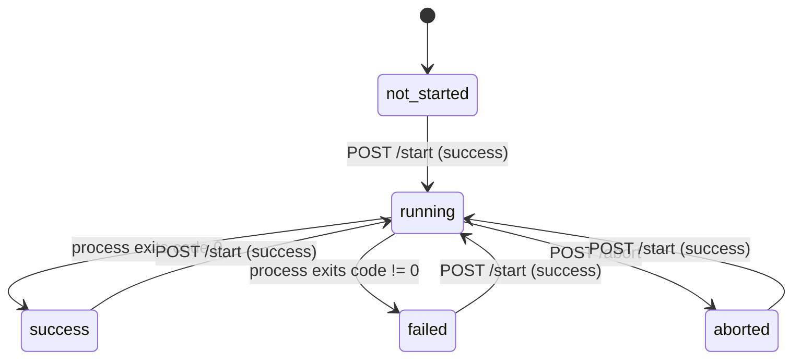

# Design Document: Health Endpoint Enhancements

## Overview

This feature enhances the KASBench Load Generator API to provide richer lifecycle observability. The changes include:

1. **StartTime/EndTime fields** on the `GET /health` response to track test duration
2. **Expanded StatusEnum** with five states (`not-started`, `running`, `success`, `failed`, `aborted`) replacing the current three-state model
3. **Live counter updates** by polling the Locust statistics SQLite database every 1 second during execution
4. **POST /abort endpoint** refinements to set status to `aborted` and record `EndTime`

These changes allow operators to observe load test lifecycle without downloading full result artifacts.

## Architecture

The existing architecture is a single FastAPI service (`app.py`) that delegates all subprocess lifecycle logic to `SubprocessManager`. This design preserves that pattern:



Key architectural decisions:
- **No new modules**: All changes stay within `models.py` and `subprocess_manager.py`
- **Single monitor loop**: The existing `_monitor_process` coroutine is extended to both poll the process and read counters from the stats DB in its 1-second loop
- **In-memory state**: `StartTime` and `EndTime` are stored as `Optional[str]` fields on `SubprocessManager`, matching the existing pattern for `_status`, `_role`, and counters
- **Abort flag**: A boolean `_aborted` flag disambiguates whether a process exit was caused by the abort endpoint vs natural termination

## Components and Interfaces

### Modified Components

#### `models.py`

| Change | Detail |
|--------|--------|
| `StatusEnum` | Replace `COMPLETED` with `SUCCESS`, `FAILED`, `ABORTED` |
| `HealthResponse` | Add `StartTime: Optional[str]`, `EndTime: Optional[str]` fields |

#### `subprocess_manager.py`

| Change | Detail |
|--------|--------|
| New fields | `_start_time: Optional[str]`, `_end_time: Optional[str]`, `_aborted: bool` |
| `start()` | Record `_start_time`, reset `_end_time` to `None`, reset `_aborted` to `False` |
| `abort()` | Set `_aborted = True`, set status to `ABORTED`, record `_end_time` |
| `_monitor_process()` | Poll stats DB every 1s, perform final read on exit, set `_end_time`, determine `SUCCESS` vs `FAILED` based on exit code |
| `get_health()` | Include `StartTime` and `EndTime` in response |

### Interface: GET /health Response

```json
{
  "Status": "running",
  "Role": "trader",
  "Health": "healthy",
  "SuccessCount": 142,
  "FailureCount": 3,
  "InternalErrorCount": 0,
  "LastFiveErrorMessages": [],
  "CurrentTimeStamp": "2025-01-15T10:30:00.123Z",
  "StartTime": "2025-01-15T10:25:00.456Z",
  "EndTime": null
}
```

### Interface: POST /abort Response

```json
{
  "StopTimeStamp": "2025-01-15T10:35:00.789Z"
}
```

No changes to the existing abort response shape — only the internal status transition logic changes.

## Data Models

### Updated `StatusEnum`

```python
class StatusEnum(str, Enum):
    NOT_STARTED = "not-started"
    RUNNING = "running"
    SUCCESS = "success"
    FAILED = "failed"
    ABORTED = "aborted"
```

### Updated `HealthResponse`

```python
class HealthResponse(BaseModel):
    Status: StatusEnum
    Role: str
    Health: Literal["healthy", "unhealthy"]
    SuccessCount: int
    FailureCount: int
    InternalErrorCount: int
    LastFiveErrorMessages: list[str]
    CurrentTimeStamp: str
    StartTime: str | None
    EndTime: str | None
```

### `SubprocessManager` Internal State

```python
class SubprocessManager:
    _status: StatusEnum          # lifecycle state
    _role: str                   # current role
    _success_count: int          # from Locust stats DB
    _failure_count: int          # from Locust stats DB
    _internal_error_count: int   # our internal errors
    _last_five_errors: list[str] # bounded FIFO
    _start_time: str | None      # NEW: ISO 8601 UTC timestamp
    _end_time: str | None        # NEW: ISO 8601 UTC timestamp
    _aborted: bool               # NEW: abort flag for status determination
    _process: subprocess.Popen | None
    _monitor_task: asyncio.Task | None
    _output_file: IO | None
```

### State Machine



### Locust Statistics DB Schema (read-only)

The monitor reads from the Locust-created SQLite database. The relevant table:

```sql
-- Locust creates this table for request statistics
SELECT COALESCE(SUM(num_requests), 0) AS success_count,
       COALESCE(SUM(num_failures), 0) AS failure_count
FROM requests;
```

The exact query will read aggregate counts from Locust's stats persistence. If the table doesn't exist yet (Locust hasn't written it), the monitor treats this as a no-op (counters stay at 0).

## Correctness Properties

*A property is a characteristic or behavior that should hold true across all valid executions of a system — essentially, a formal statement about what the system should do. Properties serve as the bridge between human-readable specifications and machine-verifiable correctness guarantees.*

### Property 1: StartTime is recorded on successful start and persists

*For any* valid `StartRequest` that results in a successful subprocess launch, the `HealthResponse.StartTime` field SHALL be a non-null ISO 8601 UTC timestamp, and this value SHALL persist unchanged through any subsequent terminal state (success, failed, aborted) until a new start request is processed.

**Validates: Requirements 1.1, 1.3, 1.4**

### Property 2: EndTime lifecycle — null while running, set on termination

*For any* subprocess that is currently running, the `HealthResponse.EndTime` field SHALL be null. *For any* subprocess that transitions to a terminal state (success, failed, or aborted), the `EndTime` field SHALL be a non-null ISO 8601 UTC timestamp.

**Validates: Requirements 2.1, 2.2, 2.3, 2.5**

### Property 3: Status determination by exit code and abort flag

*For any* Locust process that exits with code 0 without being aborted, the status SHALL be "success". *For any* Locust process that exits with a non-zero exit code without being aborted, the status SHALL be "failed". *For any* Locust process terminated via the abort endpoint, the status SHALL be "aborted" regardless of exit code.

**Validates: Requirements 3.2, 3.3, 3.4**

### Property 4: Counters reflect Locust statistics database

*For any* state of the Locust statistics database containing N successful requests and M failed requests, after the monitor reads the database, `SuccessCount` SHALL equal N and `FailureCount` SHALL equal M.

**Validates: Requirements 4.1, 4.2**

### Property 5: Error recording bounded FIFO

*For any* sequence of K internal errors (K ≥ 1), `LastFiveErrorMessages` SHALL contain exactly `min(K, 5)` messages corresponding to the K most recent errors in chronological order (oldest first), and `InternalErrorCount` SHALL equal K.

**Validates: Requirements 4.3, 4.4, 4.5**

### Property 6: Counter reset on start

*For any* `SubprocessManager` state with non-zero counters or non-empty error list, after a successful `POST /start` request, `SuccessCount` SHALL be 0, `FailureCount` SHALL be 0, `InternalErrorCount` SHALL be 0, and `LastFiveErrorMessages` SHALL be empty.

**Validates: Requirements 4.6**

### Property 7: Abort rejection when not running

*For any* `SubprocessManager` status that is not "running" (i.e., "not-started", "success", "failed", or "aborted"), a `POST /abort` request SHALL return HTTP 409.

**Validates: Requirements 5.5**

### Property 8: Successful abort returns valid StopTimeStamp

*For any* running subprocess that is successfully terminated via `POST /abort`, the response SHALL be HTTP 200 with a `StopTimeStamp` field containing a valid ISO 8601 UTC timestamp with millisecond precision.

**Validates: Requirements 5.3**

## Error Handling

### Subprocess Launch Errors

| Error Type | HTTP Status | Status Transition | Detail |
|------------|-------------|-------------------|--------|
| `OSError`, `PermissionError` | 500 | No change (Req 3.7) | "Failed to start subprocess: {msg}" |
| `MemoryError`, `BlockingIOError` | 503 | No change (Req 3.7) | "Resource unavailable: {msg}" |

### Abort Errors

| Error Type | HTTP Status | Status Transition | Detail |
|------------|-------------|-------------------|--------|
| Not running | 409 | No change | "No subprocess is currently running" |
| `ProcessLookupError`, `OSError` | 500 | → `failed` (Req 5.7) | "Failed to terminate subprocess: {msg}" |

### Monitor Loop Errors

| Error Type | Action | Detail |
|------------|--------|--------|
| `sqlite3.Error` | Increment `InternalErrorCount`, append to `LastFiveErrorMessages` | DB read failure |
| `OSError` | Increment `InternalErrorCount`, append to `LastFiveErrorMessages` | File access failure |

The monitor loop MUST NOT crash on errors — it catches all exceptions during DB reads, records them, and continues polling.

### Timestamp Generation

All timestamps use UTC with millisecond precision: `YYYY-MM-DDTHH:MM:SS.mmmZ`. The helper pattern:

```python
now = datetime.now(timezone.utc)
timestamp = now.strftime("%Y-%m-%dT%H:%M:%S.") + f"{now.microsecond // 1000:03d}Z"
```

## Testing Strategy

### Property-Based Testing (Hypothesis)

The project already includes `hypothesis>=6.120.0` in dev dependencies. Property-based tests will validate the correctness properties defined above.

**Configuration:**
- Minimum 100 examples per property test (Hypothesis default `max_examples=100`)
- Each test tagged with: `# Feature: health-endpoint-enhancements, Property {N}: {title}`

**Key generators:**
- `valid_start_request()` — generates `StartRequest` objects with random valid roles, durations, intensities, and URLs
- `exit_code()` — generates integers (0 for success, non-zero for failure)
- `error_sequence(min_size, max_size)` — generates lists of error message strings

**Property test targets (unit-level, mocked subprocess):**
- Properties 1–3: Test `SubprocessManager` state transitions with mocked `Popen`
- Properties 4–5: Test `_record_error()` and DB-reading logic with in-memory SQLite
- Property 6: Test counter reset after start
- Properties 7–8: Test abort endpoint guard logic and response format

### Unit Tests (Example-Based)

- Initial state: fresh manager has `status=not-started`, `StartTime=None`, `EndTime=None`
- StatusEnum has exactly 5 values
- SIGTERM → SIGKILL escalation after timeout (mocked process)
- Launch failure preserves status (mocked Popen raising OSError)
- Abort OS error sets status to "failed"

### Integration Tests

- Full lifecycle: start → monitor polls → process exits → final counters correct
- Abort during execution → EndTime set, status "aborted"
- Sequential runs: start → complete → start → verify reset

### Test File Organization

```
tests/
├── test_models.py              # StatusEnum values, HealthResponse schema
├── test_health.py              # GET /health response structure
├── test_start.py               # POST /start behavior
├── test_abort.py               # POST /abort behavior
├── test_subprocess_manager.py  # State transitions, monitor logic
├── test_monitor.py             # DB polling, counter updates
└── test_properties.py          # NEW: Property-based tests
```

