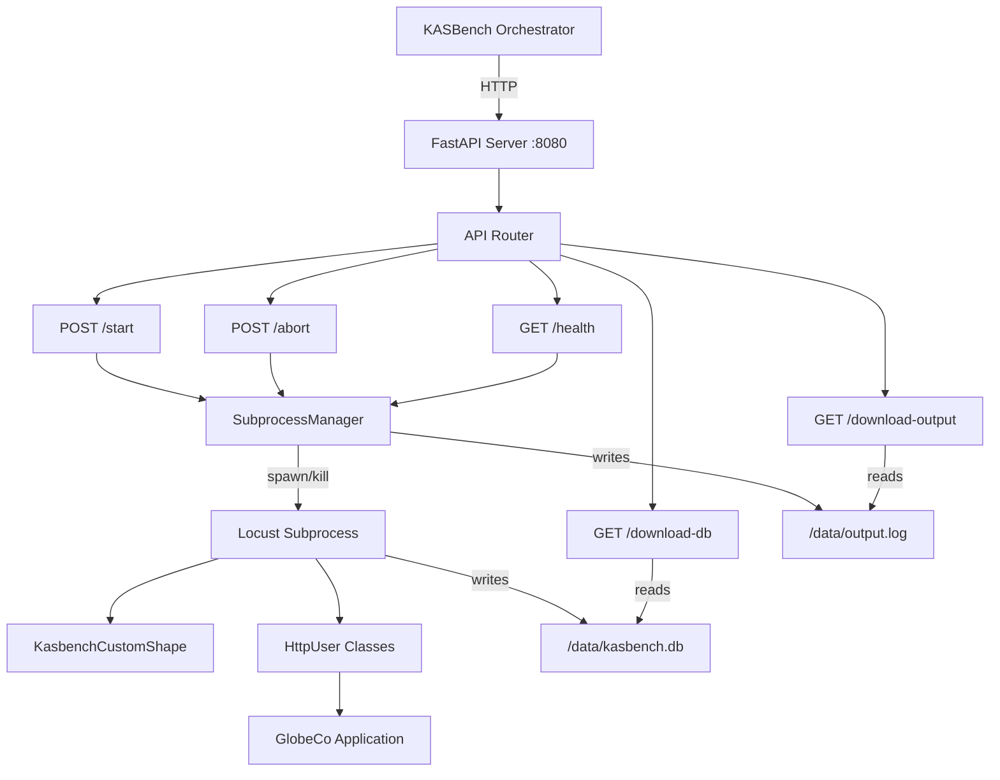
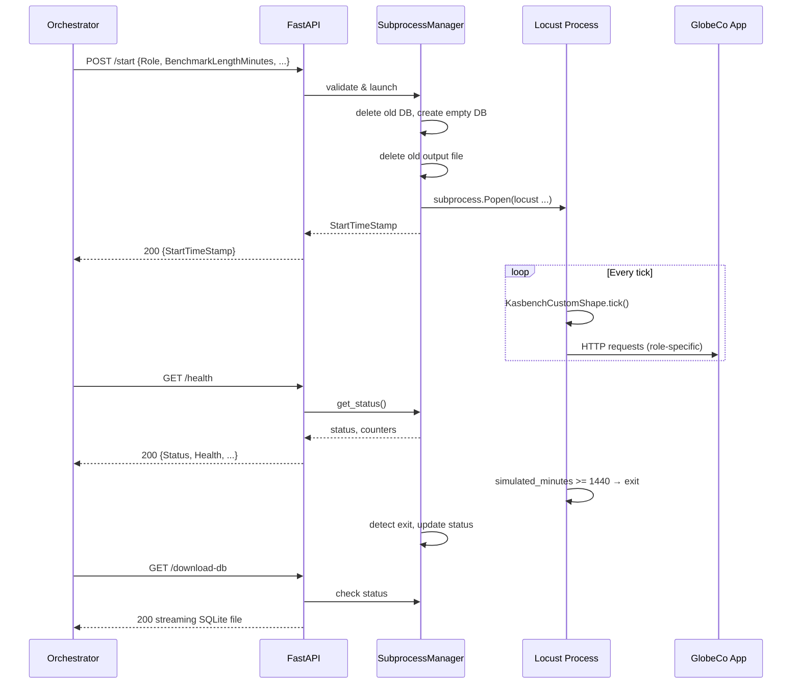
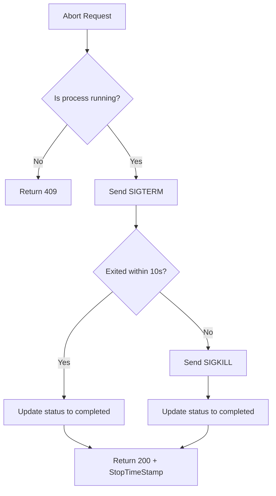

# Design Document: KASBench Load Generator

## Overview

The KASBench Load Generator is a FastAPI microservice that manages a Locust subprocess to produce variable HTTP load against the GlobeCo application in Kubernetes. The service exposes REST endpoints for lifecycle management (start, abort, health) and artifact retrieval (database, stdout/stderr download). Each instance runs a single role-specific load profile controlled by a custom `LoadTestShape` that maps simulated time to user counts via precalculated `INTENSITY_LOOKUP` tables.

### Key Design Decisions

1. **Single-process subprocess model**: Locust runs as a child process (not in-process) to isolate failures and allow clean termination. The FastAPI process manages exactly one subprocess at a time.
2. **File-based artifact storage**: SQLite database and stdout/stderr output are stored at fixed filesystem paths, enabling streaming downloads without buffering entire files in memory.
3. **Custom LoadTestShape**: The shape class uses lookup tables and a compression ratio to simulate a full 24-hour load profile in a configurable duration.
4. **In-memory state with file backing**: Health counters and status are maintained in application memory. The subprocess output is captured to a file in real time.

## Architecture



### Component Interaction Flow



## Components and Interfaces

### 1. FastAPI Application (`app.py`)

The main application module that creates the FastAPI instance, registers routes, and configures the server.

```python
# Public interface
app = FastAPI(title="KASBench Load Generator")

@app.get("/health")
async def health() -> HealthResponse: ...

@app.post("/start")
async def start(request: StartRequest) -> StartResponse: ...

@app.post("/abort")
async def abort() -> AbortResponse: ...

@app.get("/download-db")
async def download_db() -> StreamingResponse: ...

@app.get("/download-output")
async def download_output() -> StreamingResponse: ...
```

### 2. Request/Response Models (`models.py`)

Pydantic models for API validation and serialization.

```python
from pydantic import BaseModel, Field, HttpUrl
from typing import Literal
from enum import Enum

class RoleEnum(str, Enum):
    PORTFOLIO_MANAGER = "portfolio-manager"
    TRADER = "trader"
    BACK_OFFICE = "back-office"
    INVESTOR = "investor"
    IT_OPERATIONS = "it-operations"

class StatusEnum(str, Enum):
    NOT_STARTED = "not-started"
    RUNNING = "running"
    COMPLETED = "completed"

class StartRequest(BaseModel):
    Role: RoleEnum
    BenchmarkLengthMinutes: int = Field(ge=1, le=1440)
    BaseLoadIntensity: int = Field(ge=1, le=1000)
    SpawnRate: int = Field(ge=1, le=100)
    BaseDelayPercentage: int = Field(ge=0, le=1000)
    KasbenchUrl: str  # validated as HTTP/HTTPS URL

class StartResponse(BaseModel):
    StartTimeStamp: str

class AbortResponse(BaseModel):
    StopTimeStamp: str

class HealthResponse(BaseModel):
    Status: StatusEnum
    Role: str
    Health: Literal["healthy", "unhealthy"]
    SuccessCount: int
    FailureCount: int
    InternalErrorCount: int
    LastFiveErrorMessages: list[str]
    CurrentTimeStamp: str

class ErrorResponse(BaseModel):
    error: str
```

### 3. Subprocess Manager (`subprocess_manager.py`)

Manages the lifecycle of the Locust subprocess. This is the core coordination component.

```python
class SubprocessManager:
    """Manages exactly one Locust subprocess at a time."""
    
    def __init__(self, db_path: str, output_path: str):
        self._process: subprocess.Popen | None
        self._status: StatusEnum
        self._role: str
        self._success_count: int
        self._failure_count: int
        self._internal_error_count: int
        self._last_five_errors: list[str]
        self._monitor_task: asyncio.Task | None
    
    @property
    def is_running(self) -> bool: ...
    
    def get_health(self) -> HealthResponse: ...
    
    async def start(self, request: StartRequest) -> StartResponse: ...
    
    async def abort(self) -> AbortResponse: ...
    
    def _build_locust_command(self, request: StartRequest) -> list[str]: ...
    
    async def _monitor_process(self) -> None: ...
    
    def _prepare_artifacts(self) -> None: ...
```

### 4. Custom Load Shape (`locustfile.py` / `kasbench_shape.py`)

The Locust configuration file containing the custom shape class and user classes.

```python
class KasbenchCustomShape(LoadTestShape):
    """Custom shape that maps simulated time to user count via INTENSITY_LOOKUP."""
    
    INTENSITY_LOOKUP: dict[str, dict[int, int]]  # role -> {minute: users}
    MAX_USERS: dict[str, int]                     # role -> max cap
    RUN_MINUTES: int = 1440
    EXOGENOUS_EVENT_MINUTE: int  # random int in [60, 1380]
    
    def tick(self) -> tuple[int, int] | None: ...
```

### 5. Locust User Classes (`users/`)

Five HttpUser subclasses, one per role. Initially shells with a single sleep task.

```python
class PortfolioManagerUser(HttpUser): ...
class TraderUser(HttpUser): ...
class BackOfficeUser(HttpUser): ...
class InvestorUser(HttpUser): ...
class ItOperationsUser(HttpUser): ...
```

### 6. Configuration Constants (`config.py`)

Fixed paths and defaults.

```python
DB_PATH = "/data/kasbench.db"
OUTPUT_PATH = "/data/output.log"
HOST = "0.0.0.0"
PORT = 8080
TERMINATION_TIMEOUT_SECONDS = 10
STATUS_UPDATE_TIMEOUT_SECONDS = 5
```

## Data Models

### Application State (In-Memory)

| Field | Type | Initial Value | Description |
|-------|------|---------------|-------------|
| status | StatusEnum | "not-started" | Current subprocess state |
| role | str | "" | Active role for the current/last run |
| success_count | int | 0 | Successful requests tracked |
| failure_count | int | 0 | Failed requests tracked |
| internal_error_count | int | 0 | Internal errors in the service |
| last_five_errors | list[str] | [] | Most recent error messages (max 5) |
| process | Popen \| None | None | Reference to the subprocess |
| monitor_task | Task \| None | None | Asyncio task monitoring subprocess exit |

### StartRequest Schema

| Field | Type | Constraints | Description |
|-------|------|-------------|-------------|
| Role | string (enum) | One of 5 roles | Load profile to execute |
| BenchmarkLengthMinutes | integer | [1, 1440] | Real-time duration of the benchmark |
| BaseLoadIntensity | integer | [1, 1000] | Percentage multiplier for user counts |
| SpawnRate | integer | [1, 100] | Users added per second during ramp |
| BaseDelayPercentage | integer | [0, 1000] | Task delay scaling factor |
| KasbenchUrl | string | Valid HTTP(S) URL | Target application URL |

### File Artifacts

| Artifact | Path | Format | Created |
|----------|------|--------|---------|
| SQLite Database | /data/kasbench.db | SQLite 3 | At /start, before Locust runs |
| Subprocess Output | /data/output.log | Plain text (interleaved stdout+stderr) | At /start, streamed during run |

### HealthResponse Schema

| Field | Type | Description |
|-------|------|-------------|
| Status | "not-started" \| "running" \| "completed" | Subprocess lifecycle state |
| Role | string | Active role or empty if not started |
| Health | "healthy" \| "unhealthy" | Based on InternalErrorCount |
| SuccessCount | int | Cumulative successful operations |
| FailureCount | int | Cumulative failed operations |
| InternalErrorCount | int | Service-level errors |
| LastFiveErrorMessages | list[str] | Up to 5 most recent error messages |
| CurrentTimeStamp | string | UTC ISO 8601 timestamp |


## Correctness Properties

*A property is a characteristic or behavior that should hold true across all valid executions of a system—essentially, a formal statement about what the system should do. Properties serve as the bridge between human-readable specifications and machine-verifiable correctness guarantees.*

### Property 1: Health response completeness

*For any* internal state (any valid combination of status, role, counters, and error list), the `get_health()` method SHALL return a response containing all required fields (Status, Role, Health, SuccessCount, FailureCount, InternalErrorCount, LastFiveErrorMessages, CurrentTimeStamp) where Status and Role accurately reflect the current state and CurrentTimeStamp is a valid ISO 8601 UTC string.

**Validates: Requirements 2.1, 2.3, 2.7**

### Property 2: Health field derivation from error count

*For any* internal state, if InternalErrorCount equals 0 then Health SHALL be "healthy", and if InternalErrorCount is greater than 0 then Health SHALL be "unhealthy".

**Validates: Requirements 2.5, 2.6**

### Property 3: Error list bounded invariant

*For any* sequence of N internal errors recorded (where N can be any non-negative integer), LastFiveErrorMessages SHALL contain exactly min(N, 5) entries, and those entries SHALL be the most recent N errors in chronological order (oldest first).

**Validates: Requirements 2.8**

### Property 4: Request validation rejects invalid inputs

*For any* StartRequest where at least one field violates its constraints (Role not in the 5 valid values, BenchmarkLengthMinutes outside [1,1440], BaseLoadIntensity outside [1,1000], SpawnRate outside [1,100], BaseDelayPercentage outside [0,1000], or KasbenchUrl not a valid HTTP/HTTPS URL), the validation SHALL reject the request. Conversely, *for any* StartRequest where all fields satisfy their constraints, validation SHALL accept the request.

**Validates: Requirements 3.2, 3.4, 3.5**

### Property 5: Single subprocess enforcement

*For any* operation that requires a specific subprocess state (start requires not-running, abort requires running, download-db requires not-running, download-output requires not-running), if the current state does not match the required state, the operation SHALL return HTTP 409 conflict.

**Validates: Requirements 3.3, 4.2, 5.2, 6.2, 7.1**

### Property 6: Command construction preserves all parameters

*For any* valid StartRequest and corresponding Role, the constructed Locust command-line argument list SHALL contain all six parameter values (role, benchmark_length_minutes, base_load_intensity, spawn_rate, base_delay_percentage, kasbench_url) and SHALL specify only the HttpUser subclass corresponding to the given Role.

**Validates: Requirements 3.6, 10.3**

### Property 7: State reset on new start

*For any* SubprocessManager in "completed" status with arbitrary non-zero values for SuccessCount, FailureCount, InternalErrorCount, and non-empty LastFiveErrorMessages, after a successful new /start invocation, all counters SHALL be 0, LastFiveErrorMessages SHALL be empty, Status SHALL be "running", and Role SHALL match the new request's Role.

**Validates: Requirements 7.3**

### Property 8: Tick computation for normal operation

*For any* role in {portfolio-manager, trader, back-office, investor}, any actual elapsed seconds that maps to simulated minutes < 1440, any base_load_intensity in [1, 1000], and where simulated minutes is NOT within ±30 of the exogenous event minute, `tick()` SHALL return `(floor(INTENSITY_LOOKUP[role][floor(sim_minutes/30)*30] * base_load_intensity / 100), spawn_rate)`.

**Validates: Requirements 8.1, 8.2, 8.5, 8.6**

### Property 9: Tick terminates at simulated day boundary

*For any* (actual_elapsed_seconds, ratio) pair where `floor(actual_elapsed_seconds * ratio / 60) >= 1440`, `tick()` SHALL return None regardless of role or other parameters.

**Validates: Requirements 8.3**

### Property 10: IT-operations constant user count

*For any* actual elapsed seconds that maps to simulated minutes < 1440, when role is "it-operations", `tick()` SHALL return `(1, spawn_rate)` regardless of INTENSITY_LOOKUP, base_load_intensity, or exogenous event state.

**Validates: Requirements 8.4**

### Property 11: Exogenous event spike computation

*For any* role in {portfolio-manager, trader, back-office, investor} and any simulated minute within the range [exogenous_event_minute − 30, exogenous_event_minute + 30] (inclusive), the user count before base_load_intensity scaling SHALL equal `max(floor(1.5 * INTENSITY_LOOKUP[role][lookup_key]), MAX_USERS[role])`.

**Validates: Requirements 8.7, 9.2**

### Property 12: Exogenous event minute range invariant

*For any* instantiation of the Custom_Shape class, the EXOGENOUS_EVENT_MINUTE value SHALL be an integer in the inclusive range [60, 1380].

**Validates: Requirements 9.1**

## Error Handling

### HTTP Error Response Strategy

| Scenario | HTTP Status | Response Body |
|----------|-------------|---------------|
| Invalid request fields (type, range, missing) | 400 | `{"error": "<field> <reason>"}` |
| Start while already running | 409 | `{"error": "A subprocess is already running"}` |
| Abort while not running | 409 | `{"error": "No subprocess is currently running"}` |
| Download while running | 409 | `{"error": "Subprocess is still active"}` |
| Database file not found | 404 | `{"error": "Database file not available"}` |
| Output not available | 404 | `{"error": "No output available"}` |
| System-level failure (OSError, PermissionError) | 500 | `{"error": "<reason>"}` |
| Resource exhaustion (MemoryError) | 503 | `{"error": "<reason>"}` |

### Error Classification Logic

```python
def classify_subprocess_error(exc: Exception) -> int:
    """Map exceptions to HTTP status codes."""
    if isinstance(exc, (OSError, PermissionError, ProcessLookupError)):
        return 500  # Non-recoverable
    elif isinstance(exc, (MemoryError, BlockingIOError)):
        return 503  # Temporary/resource
    else:
        return 500  # Default to non-recoverable
```

### Internal Error Tracking

- Internal errors (errors within the FastAPI service itself, not user errors) are tracked in `internal_error_count` and `last_five_errors`
- User validation errors (400) do NOT increment internal error counters
- Conflict errors (409) do NOT increment internal error counters
- Only unexpected exceptions during subprocess management or file operations increment the counter
- The error list is a bounded FIFO queue: when a 6th error arrives, the oldest is evicted

### Subprocess Termination Strategy



## Testing Strategy

### Testing Framework

- **Unit/Example tests**: `pytest` with `pytest-asyncio` for async endpoint testing
- **Property-based tests**: `hypothesis` (Python's standard PBT library)
- **HTTP testing**: `httpx` with `pytest-httpx` or FastAPI's `TestClient`
- **Mocking**: `unittest.mock` for subprocess isolation

### Property-Based Tests

Each correctness property maps to a single Hypothesis test with a minimum of 100 examples. Tests are tagged with the property reference:

```python
# Feature: kasbench-load-generator, Property 8: Tick computation for normal operation
@given(
    role=st.sampled_from(["portfolio-manager", "trader", "back-office", "investor"]),
    elapsed_seconds=st.integers(min_value=0, max_value=...),
    base_load_intensity=st.integers(min_value=1, max_value=1000),
    spawn_rate=st.integers(min_value=1, max_value=100),
)
@settings(max_examples=100)
def test_tick_normal_computation(role, elapsed_seconds, base_load_intensity, spawn_rate):
    ...
```

Properties suitable for PBT:
- **Property 1-3**: Health response generation (random states → verify structure/derivation)
- **Property 4**: Validation (random inputs → verify accept/reject)
- **Property 5**: State guards (random state × operation → verify 409)
- **Property 6**: Command builder (random valid requests → verify command contents)
- **Property 7**: State reset (random prior state → verify zeroed after start)
- **Property 8-12**: Shape tick logic (random time/role/intensity → verify computation)

### Unit/Example Tests

- Initial state: fresh manager reports "not-started"
- Happy path: start → health shows "running" → process exits → health shows "completed"
- Download streaming: verify correct Content-Type headers and file content
- Abort with SIGTERM success and SIGKILL fallback
- File cleanup on new start

### Integration Tests

- Full lifecycle: start → poll health → natural completion → download artifacts
- Subprocess monitor detects exit within 5 seconds
- Interleaved stdout/stderr capture ordering

### Test Organization

```
tests/
├── test_models.py          # Property tests for validation (Property 4)
├── test_health.py          # Property tests for health derivation (Properties 1-3)
├── test_subprocess_manager.py  # Property tests for state management (Properties 5, 7)
├── test_command_builder.py # Property tests for command construction (Property 6)
├── test_shape.py           # Property tests for tick logic (Properties 8-12)
├── test_api_integration.py # Example-based API lifecycle tests
└── test_downloads.py       # Example-based streaming download tests
```
